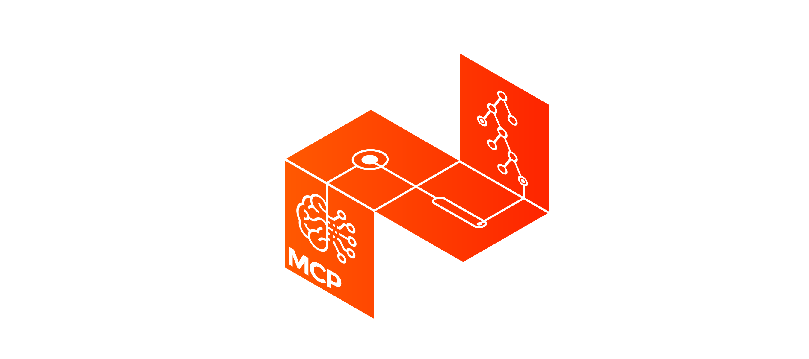

<h1 align="center"> The MCP Starter Pack</h1>

The MCP starter pack is a repository built for McMaster students interested in trying out or learning more about competitive programming. We'll include solutions and links to a variety of programming problems that we enjoyed solving at MCP and continually update this repo. For the studious few there will be interesting articles, books, or videos that we recommend reading/watching to upgrade your Algorithm and Data Structure tool belt. 

### Table of Contents

- [Questions](#Questions)
     - [Warm-ups](#Warm-ups)
     - [Easy](#Easy)
     - [Medium](#Medium)
     - [Hard](#Hard)
- [Articles](#Articles)
    - [Graphs](#Graphs)
    - [Dynamic Programming](#Dynammic-Programming)
- [FAQ](#FAQ)

## Questions

### Warm-ups 

Most of these problems are trivial to solve but you can use them to get familiar with new judging websites. 

- [Designer PDF Viewer (HackerRank)](https://www.hackerrank.com/challenges/designer-pdf-viewer/problem)
    - [C++ Solution](https://github.com/le-michael/mcp-starter-pack/blob/master/solutions/designer_pdf_viewer/sol.cpp)
    - [Python Solution](https://github.com/le-michael/mcp-starter-pack/blob/master/solutions/designer_pdf_viewer/sol.py)
- [Caesar Cipher (HackerRank)](https://www.hackerrank.com/challenges/caesar-cipher-1/problem)
    - [C++ Solution](https://github.com/le-michael/mcp-starter-pack/blob/master/solutions/caesar_cipher/sol.cpp)
    - [Python Solution](https://github.com/le-michael/mcp-starter-pack/blob/master/solutions/caesar_cipher/sol.py)
- [Diverse Strings (CodeForces)](https://codeforces.com/contest/1144/problem/A)
    - [C++ Solution](https://github.com/le-michael/mcp-starter-pack/blob/master/solutions/diverse_strings/sol.cpp)
    - [Python Solution](https://github.com/le-michael/mcp-starter-pack/blob/master/solutions/diverse_strings/sol.py)

### Easy

These problems are a great place to build the foundation of your algorithm and data structure skills. Most of these problems will test your knowledge on fundamental algorithms.

- [BFS Breadth First Search: Shortest Reach (HackerRank)](https://www.hackerrank.com/challenges/bfsshortreach/problem)
    - [Python Solution](https://github.com/le-michael/mcp-starter-pack/blob/master/solutions/breadth_first_search_shortest_reach/sol.py)
- [Roads and Libraries (HackerRank)](https://www.hackerrank.com/challenges/torque-and-development/problem)
    - [Python Solution](https://github.com/le-michael/mcp-starter-pack/blob/master/solutions/roads_and_libs/sol.py)
### Medium

When you've got the fundamentals figured out try these problems.
- [Edgy Trees (CodeForces)](https://codeforces.com/contest/1139/problem/C)
    - [Python Solution](https://github.com/le-michael/mcp-starter-pack/blob/master/solutions/edgy_trees/sol.py)
- [Rust & Murderer (HackerRank)](https://www.hackerrank.com/challenges/rust-murderer/problem)
    - [Python Solution](https://github.com/le-michael/mcp-starter-pack/blob/master/solutions/rust_murderer/sol.py)

### Hard

Challenging questions but very rewarding to solve. 

- [Kth Ancestor (HackerRank)](https://www.hackerrank.com/challenges/kth-ancestor/problem)
    - [C++ Solution](https://github.com/le-michael/mcp-starter-pack/blob/master/solutions/kth_ancestor/sol.cpp)
    - [Python Solution](https://github.com/le-michael/mcp-starter-pack/blob/master/solutions/kth_ancestor/sol.py)

## Articles
### Graphs
-
  [Union Find (geeksforgeeks)](https://www.geeksforgeeks.org/union-find-algorithm-set-2-union-by-rank/) - Partition sets efficiently with this data structure. 
- [DFS (geeksforgeeks)](https://www.geeksforgeeks.org/depth-first-search-or-dfs-for-a-graph/) - Basic graph traversing algorithm.
- [BFS (geeksforgeeks)](https://www.geeksforgeeks.org/breadth-first-search-or-bfs-for-a-graph/) - Find the shortest path in an unweighted graph.
- [Kruskal's MSP (geeksforgeeks)](https://www.geeksforgeeks.org/kruskals-minimum-spanning-tree-algorithm-greedy-algo-2/) - Greedy algorithm for building a minimum spanning tree.
### Dynamic Programming
- [Largest Sum Contiguous Subarray (geeksforgeeks)](https://www.geeksforgeeks.org/largest-sum-contiguous-subarray/) - Super basic DP everyone should know
- [Coin Change No-Limit (geeksforgeeks)](https://www.geeksforgeeks.org/coin-change-dp-7/) - Given a set of coins, find the number of combinations that add up a given sum.
- [Longest Common Subsequence (geeksforgeeks)](https://www.geeksforgeeks.org/longest-common-subsequence-dp-4/) - Find the longest common subsequence between two words.
## FAQ

### Why should I do Competitive Programming?

Competitive programming is a great way to practice for technical interviews. The problems that you solve during these contests are very similar to the types of questions you get asked during coding interviews most of the time even harder. Additionally, participating in live competitions is an amazing way to practice to remain calm and solve algorithm questions in a timed and stressful environment.

Also it's fun! :)
