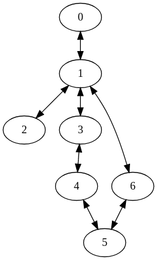

# Graph Basics (Graph Data Structures and DFS)

This guide will walk you through a very simple graph problem. All solutions will be written in python. I recommend you try it out before you look at the solution. 

- [Problem](#Problem)
- [Problem Breakdown](#problem-breakdown)
- [Solution](#Solution)
    - [Solution 1 Adjacency Matrix](#Solution-1-Adjacency-Matrix)
    - [Solution 2 Adjacency List](#Solution-2-Adjacency-List)
    - [Solution 3 Adjacency Set](#Solution-3-Adjacency-Set)

## Problem

Given **N** nodes connected by **M** bidirectional edges determine if you can travel from node **S** to node **E**.


### Input
First line gives you the value **N** followed by **M**.

Second line gives you the value **S** followed by **E**.

The next **M** lines tell you which nodes are connected by a bidirectional edge. 
#### Example:
```
7 7
0 5
0 1
1 2
3 4
1 3
1 6
6 5
4 5
```
### Output
Return a boolean stating whether you can travel from node **S** to node **E**.
#### Example:
```
true
```

## Problem Breakdown

The first thing I like to do when I get a problem is try to understand how the input is given to me. From this we can figure out how we can generate our data structures.

From the example above we can see that our input will always be **M+2** lines. Where the first line will give us the value **N** and the value **M**, and the second line gives us the value **S** and **E**.

We see that our graph will have **7** nodes and edges, and our objective is to see if we can travel from node **0** to node **5**.

The remaining lines are used to help us construct our graph. Keep in mind this graph only has bidirectional edges, this means if you can go from 0 to 1 you can go from 1 to 0. From the input above we will get a graph that will look like the following. 



When drawn out we can see that it is possible to get from node **0** to node **5**. 

## Solution

A basic problem like this can be solved in many different ways, i'm going to section off each solution based off different data structures to represent a graph. Each data structure have their pros and cons.

### Solution 1 Adjacency Matrix

#### Overview

The adjacency matrix is an **N x N** matrix that tells you whether two nodes are connected by checking if an index in the matrix has a value greater than **0**. In our case the values will only ever by **1** or **0** since our graph is unweighted.

```
Adhacency Matrix for the example above:

[ 0 1 0 0 0 0 0 ]  0 is connected to 1
[ 1 0 1 1 0 0 1 ]  1 is connected to 0, 2, 3 and 6
[ 0 1 0 0 0 0 0 ]  2 is connected to 1
[ 0 1 0 0 1 0 0 ]  3 is connected to 1 and 4
[ 0 0 0 1 0 1 0 ]  4 is connected to 3 and 5
[ 0 0 0 0 1 0 1 ]  5 is connected to 4 and 6
[ 0 1 0 0 0 1 0 ]  6 is connected to 1 and 5
```

Typically, we say that the row correlates to the node we're traveling from and the column correlates to the node we're traveling to. So if we want to see if we can travel from node 0 to node 3 we will check row 0 and column 3.

#### Build

```python
# Read the value for N and M
N, M = map(int, raw_input().split())

# Create an N x N matrix where all nodes are not
# connected to any other node
matrix = [[0 for i in range(N)] for j in range(N)]

# Read the value for S and E
S, E = map(int, raw_input().split())

# Read M lines and build the graph
for _ in range(M):
    # Read in a temp node n0 and node n1
    n0, n1 = map(int, raw_input().split())
    
    # Connect the nodes
    matrix[n0][n1] = 1
    matrix[n1][n0] = 1

# Traverse the graph and print out the solution
print solution(S, E, matrix)
```
#### Traverse

We will be using DFS (Depth First Search) to traverse the graph and to see if starting at node **S** we can reach node **E**. I will do this iteratively to make it eaiser to visualize how the graph gets traversed.


``` Python
def solution(S, E, matrix):

    # DFS uses a stack to tell our algorithm what node we are
    # coming from. Since we start at node S we put S in the
    # stack.
    stack = [S]

    # We need to create a visited set to make sure we don't
    # visit a node more than once. This prevents our program
    # from running indefinitely. For example we want to prevent
    # our program from starting at node 0 adding node 1 going
    # to 1 then adding node 0 then going back to 0 and adding
    # node 1 again and so on.
    visited = set()

    # We are going to run our algorithm until there are no more
    # nodes in our stack. This means we have visited all the nodes
    # that are reachable from node S.
    while stack:
        # We will set the current node to be the top of the stack,
        # and remove that value from the stack.
        curr_node = stack.pop()

        # Now that we are visiting the node curr_node we can add it
        # to our visited set.
        visited.add(curr_node)

        # We will iterate through the row curr since we are
        # traveling from the node with value curr.
        for next_node in range(N):

            # The following conditional is used to decide whether
            # we should add a node to the stack or not. First
            # we need to check if the current node and the next
            # node are conncted. Next we need to check if we have
            # been to the next node before. If both nodes are connected
            # and we haven't been to the next node then we will add it to
            # the stack.
            if matrix[curr_node][next_node] > 0 and next_node not in visited:
                stack.append(next_node)

        # Eventually we will visit all the nodes we can and the stack will be
        # empty.

    # If E is in visited then we can travel from S to E.
    return E in visited    

```
#### Random thoughts


Adjacency Matrix are a great data structure to use for representing weighted graphs. Instead of having 0's and 1's we can replace the 1's with the weigth of traveling from one node to the next. So let's say we have a 5 instead of a 1 at `matrix[0][1]` we now know that it costs 5 to get from 0 to 1. This is more advance so don't worry about it now.

### Solution 2 Adjacency List


#### Overview

An adjacency list will use less memory than an adjacency matrix if there
are less than **N * (N - 1)** edges in the graph, this value is the maximum number of edges in a fully connected graph. 
```
[ [ 1 ]       ]   0 is connected to 1
[ [ 0 2 3 6 ] ]   1 is connected to 0, 2, 3 and 6
[ [ 1 ]       ]   2 is connected to 1
[ [ 1 4 ]     ]   3 is connected to 1 and 4
[ [ 3 5 ]     ]   4 is connected to 3 and 5
[ [ 4 6 ]     ]   5 is connected to 4 and 6
[ [ 1 5 ]     ]   6 is connected to 1 and 5
```
This data structure improves the runtime of our traversing by only storing what node we are connected to. This saves time on determining what node to visit next. The down side to this data structure is if the problem gives duplicate entries then we might append the same node twice.

#### Build

```python
# Read the value for N and M
N, M = map(int, raw_input().split())

# Create an array of size N with N empty arrays
adj_list = [[] for i in range(N)]

# Read the value for S and E
S, E = map(int, raw_input().split())

# Read M lines and build the graph
for _ in range(M):
    # Read in a temp node n0 and node n1
    n0, n1 = map(int, raw_input().split())
    
    # Connect the nodes
    adj_list[n0].append(n1)
    adj_list[n1].append(n0)

# Traverse the graph and print out the solution
print solution(S, E, adj_list)
```

#### Traverse
Alot of the algorithm stays the same I will only comment on the new stuff. Reference Adjacency Matrix for a more in depth explanation.
``` Python
def solution(S, E, adj_list):

    stack = [S]
    visited = set()

    while stack:
        curr_node = stack.pop()
        visited.add(curr_node)
        
        # Since we store what nodes we can travel to
        # we can iterate through the values directly.
        for next_node in adj_list[curr_node]:
            # The conditional only checks whether the next node is in
            # visited now since all values for next node is reachable
            # from the current node.
            if next_node not in visited:
                stack.append(next_node)

    return E in visited    

```

#### Random thoughts

This is a good data structure to use for unweighted graphs and if we know that the problem won't give us more than **N * (N - 1)** edges. It's easily defeated by the next data strucuture however, so I wouldn't even touch this one :woman_shrugging:. 


### Solution 3 Adjacency Set

#### Overview

The adjacency set works the same as an adjacency list but better. Thanks to the magic of sets we can only ever have unique values in a set, this allows us to easily process problems that give us duplicate edges. Additionaly, if we want to check if two nodes are connected this can now be done in **O( 1 )** (constant time) versus **O( N )** (linear time) in an adjacency list.

```
[ set( 1 )       ]   0 is connected to 1
[ set( 0 2 3 6 ) ]   1 is connected to 0, 2, 3 and 6
[ set( 1 )       ]   2 is connected to 1
[ set( 1 4 )     ]   3 is connected to 1 and 4
[ set( 3 5 )     ]   4 is connected to 3 and 5
[ set( 4 6 )     ]   5 is connected to 4 and 6
[ set( 1 5 )     ]   6 is connected to 1 and 5
```

#### Build

```python
# Read the value for N and M
N, M = map(int, raw_input().split())

# Create an array of size N with N empty sets
adj_set = [set() for i in range(N)]

# Read the value for S and E
S, E = map(int, raw_input().split())

# Read M lines and build the graph
for _ in range(M):
    # Read in a temp node n0 and node n1
    n0, n1 = map(int, raw_input().split())
    
    # Connect the nodes
    adj_set[n0].add(n1)
    adj_set[n1].add(n0)

# Traverse the graph and print out the solution
print solution(S, E, adj_set)
```

#### Traverse
Literally the exact same code as the adjacency list. Reference Adjacency Matrix for a more in depth explanation.
``` Python
def solution(S, E, adj_set):

    stack = [S]
    visited = set()

    while stack:
        curr_node = stack.pop()
        visited.add(curr_node)
        for next_node in adj_set[curr_node]:
            if next_node not in visited:
                stack.append(next_node)

    return E in visited    
```
#### Random thoughts

Just use this one it's really good. Also you don't have to store the sets in an array if you're using python, you can use a dictonary instead to save space.
