# Union Find 

- [Problem](#Problem)
- [Problem Breakdown](#problem-breakdown)
- [Trivial Approach](#Trivial-Approach)
- [Solution](#Solution)
    - [Union Find Overview](#Union-Find-Overview)
    - [Code](#Code)
    - [Path Compression Optimization](#Path-Compression-Optimization)
    - [Full Solution](#Full-Solution)

## Problem

Given **N** nodes, and **M** bidirectional edges denoting how nodes are connected, complete **Q** queries determining if you can travel from node **S** to node **E**, where  the values of **S** and **E** change in each query.


### Input
First line gives you the value **N** nodes, **M** edges and **Q** queries.

The next **M** lines tell you which nodes are connected by a bidirectional edge.

The next **Q** queries will give you a node **S** and node **E**.
#### Example:
```
11 8 3
0 3
1 7
3 1
4 3
5 2
2 8
9 10
9 8
6 0
5 10
0 7
```
### Output
Return **Q** booleans stating whether you can travel from node **S** to node **E**.
#### Example:
```
false
true
true
```

## Problem Breakdown

From the input we can see that this is a typical graph question. They give you a value for the number of nodes (**N**), a value for the number of edges (**M**) followed by **M** values telling use how the graph is connected.

The resulting graph will look like the following:

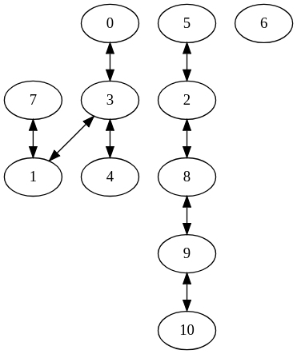

The last **Q** lines of inputs give us a value **S** and **E** and our goal is to figure out if we can travel from **S** to **E**, where **S** and **E** change in each query .  

We will have to print out **Q** boolean values for this problem. For the example output we see that our first case should return false since you cannot travel to node **0** from node **6**, the second case is possible because you can travel from node **5** to node **10**, and finally we can travel from **0** to **7** so the last case is also possible.


## Trivial Approach 

At an intial glance this problem looks very similar to a simple DFS problem. Infact it's almost the same problem as the one I wrote about in the graph basics guide ([Graph Basics Guide](https://github.com/le-michael/mcp-starter-pack/blob/master/guides/graph_basics.md)). The only thing that I changed is that we're now doing multiple search queries instead of just one.

A DFS solution to this problem would look something like this:

``` python
def solution(S, E, graph):
    stack = [S]
    visited = set()

    while stack:
        curr_node = stack.pop()
        visited.add(curr_node)
        for next_node in graph[curr_node]:
            if next_node not in visited:
                stack.append(next_node)

    return E in visited


N, M, Q = map(int, raw_input().split())

graph = [set() for i in range(N)]

# Build the graph
for _ in range(M):
    n0, n1 = map(int, raw_input().split())

    graph[n0].add(n1)
    graph[n1].add(n0)

for _ in range(Q):
    S, E = map(int, raw_input().split())
    print solution(S, E, graph)
```

This does exactly what we need but this isn't the best solution. The problem with this approach is that it's slow; each query could be worst case **O(N)**. 

Imagine our graph looked like the following:

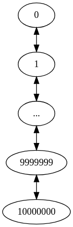

We are given a large chain as our graph. Now imagine if the problem gives you a test case with 1000000 queries where in each query the value of **S** is between 0 and 100 and the value of **E** is between 9999900 and 10000000. The solution above will be too slow to solve this case because for each query we're going to visit every node between **S** and **E**, worst case we will visit 1000000 * 10000001 nodes!

So yes, this solution is correct but you won't get all the test cases!

## Solution

### Union Find Overview

Union find also known as the disjoint set data structure changes the way we look at graphs. Instead of caring about how each node is connected to each other we only care about what group each node belongs to.

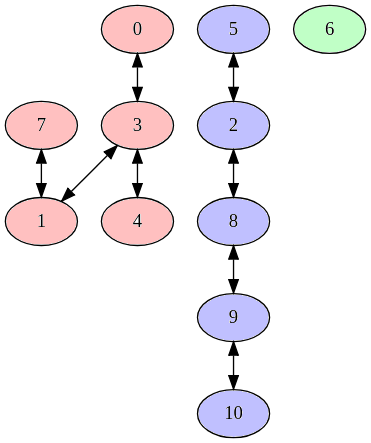

The image above isn't really representive of how a graph looks after completing union find but it helps show how you can view these nodes as belonging to a distinct group.

Since this graph is not directed we know that any two nodes in the same group can travel to each other. So we can rephrase our objective from being can you travel from **S** to **E** to is **S** and **E** in the same group.

#### Initial State

Our goal is to build a data structure that can represent this grouping relation.

Before we can move forward we need to know the inital state of the graph before the input tells us how the nodes are connected. Each node is initially said to belong in it's own group.

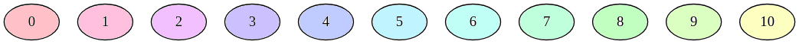

Graphically, it would look like the picture above. In code, instead of using colours you would give each group an id.

```python
# node 0 will belong to group 0
# node 1 will belong to group 1
# ...
# node N-1 will belong to group N-1
parent = [i for i in range(N)]
```

The array is named parent because what we will store is the parent group that the node belongs to. So in the initial state the parent group of all nodes will be its' index. The way I look at the parent array is when I do a query `parent[0]` i'm asking for the parent of node 0.

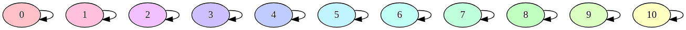

The image above is a more appropriate representation of the graph in its' initial state because each node has an edge pointing to itself. 

#### Graphical Example

Before we look at the code let's do a graphical example to get an idea of how the data structure is built. I will be building the graph based on the example in the problem statement.

##### Initial State:

##### Connect 0 to 3:
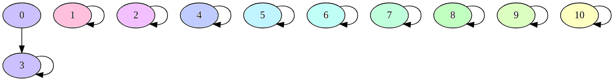
##### Connect 1 to 7:
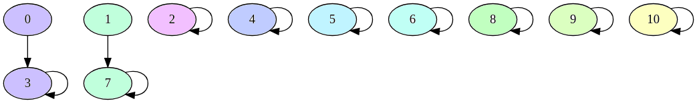
##### Connect 3 to 1:
At first this case may look confusing. Why did I decide to connect 3 to 7 instead of 3 to 1? 

In union find the general rule is to connect the parent of one group to the parent of the other. This prevents the group from breaking. In this case we could connect 3 to 1 because 3 is a root so it won't really effect the group. But let's say I wanted to connect 0 to 1. If I were to do that 0, 1, and 7 will be connected but 3 wouldn't be, now our graph is all wrong. So to prevent this we always connect the parent of a group to the parent of another group.

That's a very simple example, but you should play around with more cases and try to figure out when not connecting the parent will break our data structure!

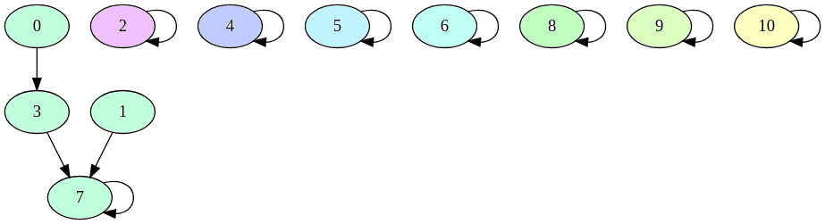
##### Connect 4 to 3:
Find the parent of 4 which is 4.

Find the parent of 3 which is 7.

Point 4 to 7.

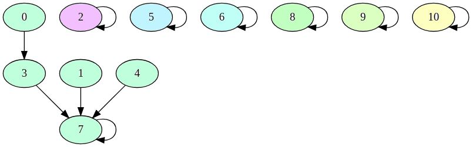
##### Connect 5 to 2:
Find the parent of 5 which is 5.

Find the parent of 2 which is 2.

Point 5 to 2.
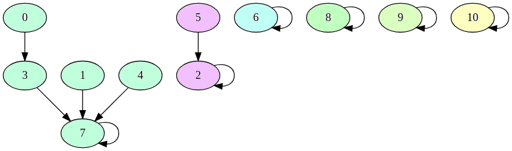
##### Connect 2 to 8:
Find the parent of 2 which is 2.

Find the parent of 8 which is 8.

Point 2 to 8.

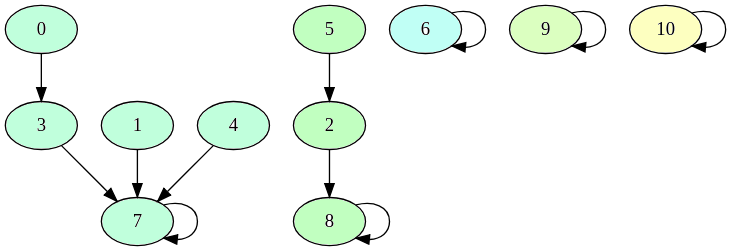
##### Connect 9 to 10:
Find the parent of 9 which is 9.

Find the parent of 10 which is 10.

Point 9 to 10.


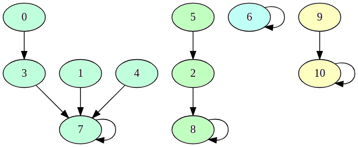
##### Connect 9 to 8:
Find the parent of 9 which is 10.

Find the parent of 8 which is 8.

Point 10 to 8.

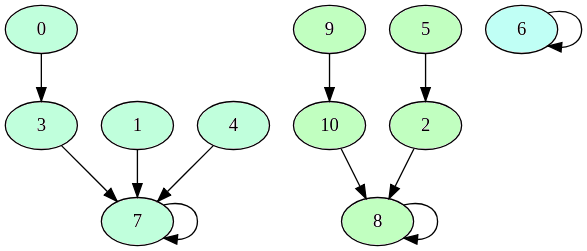

### Code

The name Union Find comes from the two functions that we use to build this data structure. The find function returns what group a node belongs to and the union function combines two group into one.
``` python

def find(node):
    # When the node is pointing to itself
    # we will return the node as the group id.
    if parent[node] == node:
        return node

    # Keep following the arrows(path) until
    # you hit the node that points to itself(root)
    return find(parent[node])


def union(node0, node1):
    # Find the parent of node 0
    parentOfNode0 = find(node0)
    # Find the parent of node 1
    parentOfNode1 = find(node1)

    # If both parents are different we have
    # to combine the groups. So we point the parent of 
    # node 0 to the parent of node 1.
    if parentOfNode0 != parentOfNode1:
        parent[parentOfNode0] = parentOfNode1

```

Our almost final solution will look something like this.
``` python
def find(node):
    if parent[node] == node:
        return node
    return find(parent[node])

def union(node0, node1):
    parentOfNode0 = find(node0)
    parentOfNode1 = find(node1)

    if parentOfNode0 != parentOfNode1:
        parent[parentOfNode0] = parentOfNode1

N, M, Q = map(int, raw_input().split())
parent = [i for i in range(N)]

for _ in range(M):
    node0, node1 = map(int, raw_input().split())
    union(node0, node1)

for _ in range(Q):
    S, E = map(int, raw_input().split())
    # If they share the same parents you can travel from S to E
    print find(S) == find(E)
```

This solution is close to the final product but we can add one more line of optimization to transform this solution from worst case O(N) find (basically the same worse case as DFS) to O(1) find.

### Path Compression Optimization

Path compression is a simple optimization technique that only works well if we are computing multiple find queries.

Its goal is to make sure that all nodes will end up pointing to its' parent.

The only thing we need to change is the find function.
``` python
def find(node):
    # Change the == to != cause we want to 
    # perform this operation when we're not
    # at the root.
    if node != parent[node]

        # The right side of the equal sign will follow
        # the path all the way to the root. When it gets
        # to the root it will return that value all the way
        # back.
        #
        # The left side of the equal sign will get that value
        # and set the it's parent to be the root.
        #
        # Now imagine if this was a long chain.
        # 
        # You go up to the root, get the value of the root and 
        # as you go down the chain ever child that called 
        # this function will point itself to the parent.
        parent[node] = find(parent[node])

    # Return your parent
    return parent[node]

```

Let's do a simple example to show how this works.

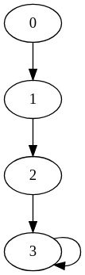

We built our grouping data structure and we get the graph above. When we call find on node 0 `find(0)` without our optimization, what happens is we start at 0 travel to 1, 2, then 3. Once we get to 3 we have to travel back, 3, 2, 1, 0 then the value 3 is returned. Every time we do this we have have to travel that same path even though we've done it before and know the value at the end of `find(0)`

With path compression we restructure the graph every time we do a find call. So for the graph above the following happens:
```
1. call `find(0)`
2. the parent of 0 is 1
3. call `find(1)`
4. the parent of 1 is 2
5. call `find(2)`
6. the parent of 2 is 3
7. call `find(3)`
8. the parent of 3 is 3
9. return the parent of 3 which is 3
10. set the parent of 2 to be 3
11. return the parent of 2 which is 3
12. set the parent of 1 to be 3
13. return the parent of 1 which is 3
14. set the parent of 0 to be 3
15. return the parent of 0 which is 3
```
The resulting graph after running our find function with path compression:

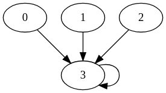

Now after calling `find(0)` we get a value 3 and also we optimized our data structure so that we don't have to travel the entire path again! We can now just jump straight to the answer on our next queries.

### Full Solution
``` python
# Just changed this function everything else is the same.
def find(node):
    if parent[node] != node:
        parent[node] = find(parent[node])
    return parent[node]

def union(node0, node1):
    parentOfNode0 = find(node0)
    parentOfNode1 = find(node1)

    if parentOfNode0 != parentOfNode1:
        parent[parentOfNode0] = parentOfNode1

N, M, Q = map(int, raw_input().split())
parent = [i for i in range(N)]

for _ in range(M):
    node0, node1 = map(int, raw_input().split())
    union(node0, node1)

for _ in range(Q):
    S, E = map(int, raw_input().split())
    # If they share the same parents you can travel from S to E
    print find(S) == find(E)
```

Now that we added path compression into our union find we have the optimal solution. So Let's look at the case that defeated our DFS solution. 


With path compression we will never have this structure seen above. Notice how the union function uses the find function. As we build this graph we are optimizing the structure, and always(ish) pointing every node to a parent node. The result will be a graph where we can query our find function in O(1). 

Additonally, with path compression the more we use the find function the more optmized our data structure becomes. This makes union find an amazing algorithm to use in query questions like these.